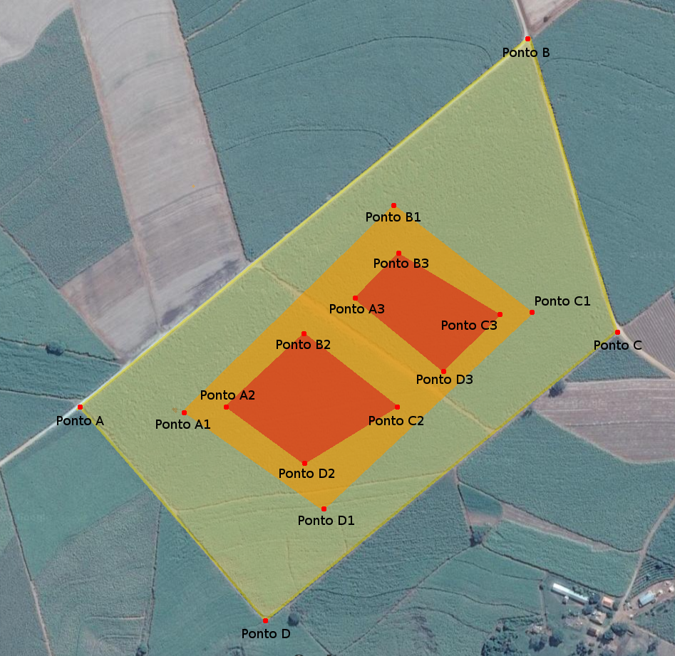

# Colheitadeira

## Objetivos

O principal objetivo desse teste é entender o seu mindset e como vc busca solucionar problemas complexos com restrições definidas.

Queremos ver qualquer código, mesmo que não esteja atendendo 100% do problema.

## Descrição

Nesse desafio, o objetivo é criar um arquivo com o resultado da colheita de uma área. Para isso, o software precisa ler do sensor de colheita e registrar a quantidade colhida para aquela área.

Nossa colheitadeira possui módulos de colheita com larguras variáveis. A mais comum possui uma largura de 10 metros. Além disso, o sensor acumula o resultado da colheita e libera esse valor a cada 10 metros percorridos pela colheitadeira fechando assim a área mínima de registro.

O arquivo de saída do software deve contar a lista das coordenadas geográficas dos centros das áreas mínimas e o valor colhido nessa área no seguinte formato:

```json
[
    {"lat": 43.998778,"lng": 22.887686,"value": 46.45},
    {"lat": 43.000322,"lng": 22.887686,"value": 44.23}
]
```
    
## Regras

O sinal do GPS e a saída do sensor de colheitas devem ser simulados pela solução de qualquer maneira possível.

A área de colheita é um polígono de 4 lados e estão definidos pelas coordenadas geográficas passadas na seção Dados.

A colheitadeira inicia o seu trabalho no canto superior esquerdo da área (ponto A) e deve seguir em direção ao canto superior direito (ponto B). Ao chegar no limte da área de colheita, ela seguirá no sentido oposto, uma faixa abaixo, seguindo assim até o final da área.

A simulação do sensor de colheita deve estar dentro do intervalo de cada curva de valor no desenho da área, sendo que as coordenadas que delimitam cada área também estão especificadas no desenho abaixo. Ou seja, se a colheitadeira estiver dentro de uma área cujo o intervalo está definido como 30-60 isso quer dizer que o valor da simulação colhida naquele quadrado deve ser um número qualquer entre 30 e 60.

## Dados

### Imagem

Essa imagem está no arquivo `desafio-inceres-colheitadeira.png` nessa pasta.

<!--  -->


### Coordenadas da área de colheita

#### Área Amarela

* Ponto A: **22° 33' 2.686" S** - **47° 43' 13.134" W**
* Ponto B: **22° 32' 44.243" S** - **47° 42' 48.881" W**
* Ponto C: **22° 32' 58.938" S** - **47° 42' 44.014" W**
* Ponto D: **22° 33' 13.421" S** - **47° 43' 3.094" W**

#### Área Laranja

* Ponto A1: **22° 33' 2.970" S** - **47° 43' 7.496" W**
* Ponto B1: **22° 32' 52.591" S** - **47° 42' 56.142" W**
* Ponto C1: **22° 32' 57.941" S** - **47° 42' 48.647" W**
* Ponto D1: **22° 33' 7.787" S**  - **47° 42' 59.926" W**

#### Área Vermelha SW

* Ponto A2: **22° 33' 2.722" S** - **47° 43' 5.218" W**
* Ponto B2: **22° 32' 59.010" S** - **47° 43' 1.009" W**
* Ponto C2: **22° 33' 2.686" S** - **47° 42' 55.908" W**
* Ponto D2: **22° 33' 5.537" S** - **47° 43' 0.930" W**

#### Área Vermelha NE

* Ponto A3: **22° 32' 57.264" S** - **47° 42' 58.187" W**
* Ponto B3: **22° 32' 54.982" S** - **47° 42' 55.872" W**
* Ponto C3: **22° 32' 58.117" S** - **47° 42' 50.386" W**
* Ponto D3: **22° 33' 0.936" S** - **47° 42' 53.438" W**

### Intervalos de valores de colheita

* Área amarela: **5-15**
* Área laranja: **15-30**
* Área vermelha SW: **30-45**
* Área vermelha NE: **30-60**

## Considerações

Deve ser feito em Python e/ou Javascript.

Faça testes unitários. Testes funcionais é um bônus.

Use o Gitlab, crie sua conta caso não tenha, faça fork desse projeto, crie uma pasta com seu nome e faça sua implementação nela. Quando pronto, faça o merge request. Seus commits também serão analisados. É uma boa forma de ver seu fluxo de pensamento.

Você tem 5 dias para terminar o teste.

É possível usar qualquer lib externa que ajude a resolver o problema. Existem algorítmos prontos na internet para isso. Por favor, não os use. Precisamos que vc desenvolva seu próprio algorítmo.

Você deve usar 100% OOP para esse desafio.

O projeto deve ser entregue com todas as instruções para ser instalado e executado.

É necessário fornecer algum tipo de feedback para indicar que a colheita está acontecendo.

A velocidade da colheitadeira não faz parte do problema, mas fique a vontade para criar... ;)

Bom código e divirta-se!
